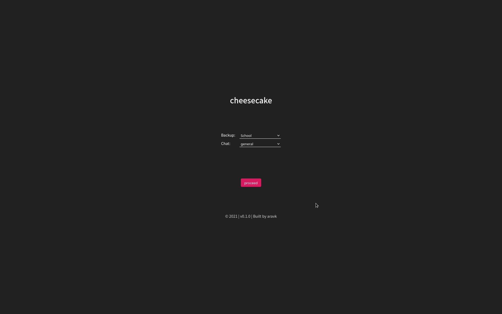
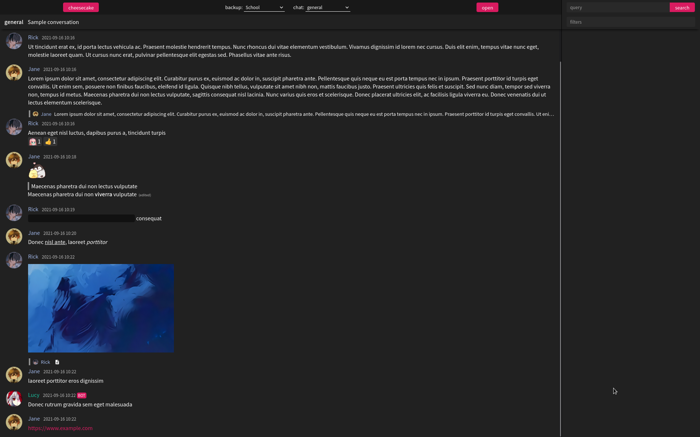

# cheesecake
A program to create and view chat backups

This repo has the program which is used to view the backups. If you want to create a chat backup, go to [cheesecake recipes](https://github.com/cubetastic33/cheesecake-recipes).

Cheesecake is intended to be a general-purpose chat archiver, so you should be able to archive chats from many different platforms. The recipes repo has scripts for creating backups from Discord, Matrix, and WhatsApp, and you can use those as templates if you want to archive messages from some other platform of your choice.

Since the archives are in a somewhat generic format, it's possible that future versions of cheesecake could render more information with the same old archives (because the archives contain some information that's unnecessary with the current version of cheesecake). Some of the data present in the archives is also there so that it's easier for scripts to modify the data.

### Contents

- [What's the point of cheesecake?](#whats-the-point-of-cheesecake)

- [Encryption support](#encryption-support)

- [When should you not use cheesecake?](#when-should-you-not-use-cheesecake)

- [How well does it work with other platforms?](#how-well-does-it-work-with-other-platforms)

- [Screenshots](#screenshots)

- [How to use](#how-to-use)

- [Contributing](#contributing)

### What's the point of cheesecake?

In simple words, cheesecake creates very extensive backups that are fast and featureful.

Now in more detail:

It doesn't backup your messages as a static HTML file or a JSON file. It stores the messages in an SQLite database, and runs a web server locally to render the messages. The database allows for accessing and searching the messages really quickly, and it's in a format that you can easily use from your own scripts. Using a web server instead of static HTML files has huge advantages - if your chats are large, and contain lots of attachments, a static webpage is completely impractical. It can take several minutes just to load the messages, and would be very slow, because all of it is being loaded at once. On the other hand, cheesecake has infinite scroll the way the actual chat platforms do - it loads a few messages first, and loads new ones on demand when you scroll up.

Probably the most important feature of cheesecake is search. Oftentimes, if you're looking at old chat archives, you're probably looking for a specific conversation. The cheesecake frontend has full-text search, and also lets you use SQL search filters. For example, you can search for all messages with `hello` with the filter `name = 'Jane'`.

The backups are portable - you can zip the folder and share it with anyone, and they should be able to view it with cheesecake after unzipping. The scripts in the recipes repo use filenames that are compatible on windows, mac, and linux, so it should be fine. If you're using your own script, though, be careful with the attachment names and such because NTFS is [_very_](https://en.wikipedia.org/wiki/Filename#In_Windows) picky about filenames.

The frontend is based on Discord, and it supports a wide variety of the features Discord does, including the following:

- MarkDown formatting like italics, bold, underline, strikethrough, spoilers
- Replies
- Custom emoji and reactions
- Regular and spoiler-tagged images
- Videos and other attachments
- Links
- Channel links, user and role mentions

The archival scripts can download _all_ the information required for the backup locally, including emoji, profile pictures, and attachments. This means the backup can get very large. So, in the case of Discord, if you don't have the assets downloaded, cheesecake will try to pull them from Discord's servers.

### Encryption support

Cheesecake also supports encrypted backups. You can use the encryption script in the cheesecake recipes repository to encrypt the database file, and cheesecake will then ask you for a password when you try to view it. However, assets are not encrypted - only the database files (so, all your messages) are.

Encryption works using the [fernet](https://github.com/fernet/spec) algorithm, and when you enter the password in the cheesecake frontend, a decrypted copy of the database is stored in a temporary location. The file is automatically deleted when you open any other backup or quit cheesecake.

### When should you not use cheesecake?

If you're just backing up a few small chats, or you don't need such extensive backups, you should probably try something else.

### How well does it work with other platforms?

There are separate archive formats for Discord and Matrix, because of the unique features they have. Then there's a generic format, which is what the WhatsApp archiver is implemented with. If you're making your own archival script, you most likely want to use the generic format. The reason Discord and Matrix have separate formats is just because those are the main platforms I intended to use cheesecake with. If you've written a script for some other platform, and you want a separate format for it, create an issue or pull request.

### Screenshots

### How to use

- Run the cheesecake executable
- Make sure you have a "refrigerator" directory, which is where all the backups (cheesecakes) are stored. You can set the location of the refrigerator with the `REFRIGERATOR` environment variable. If that doesn't exist, it looks for a directory called `refrigerator` in the current working directory. If that doesn't exist either, then the program will prompt you for the path, and store it in a config file so it doesn't have to ask you again.
- Open http://localhost:4000

### Contributing

Please feel free to make issues or pull requests!
